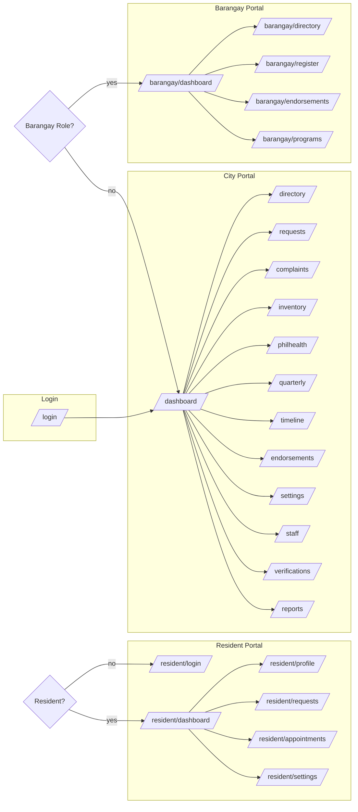
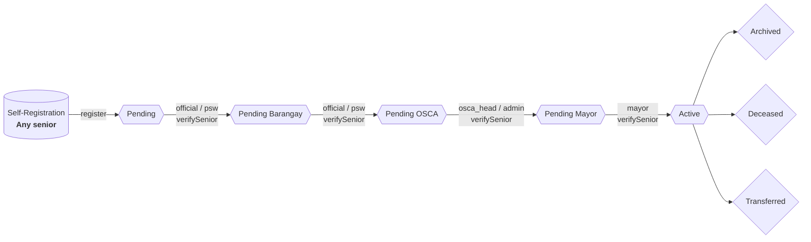
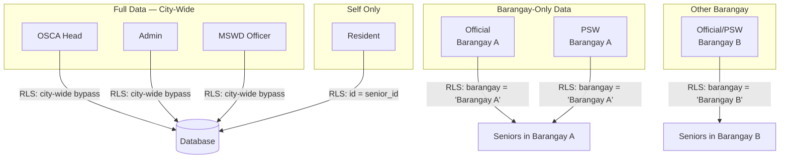
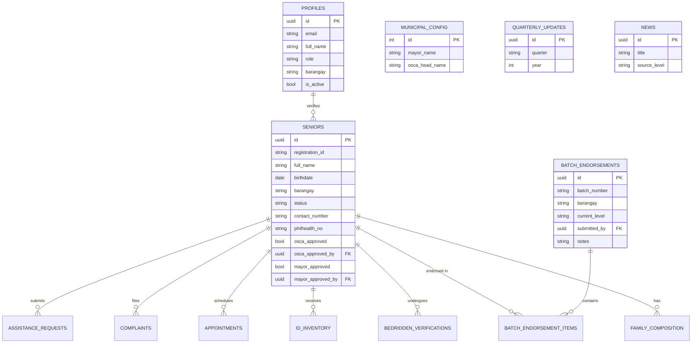
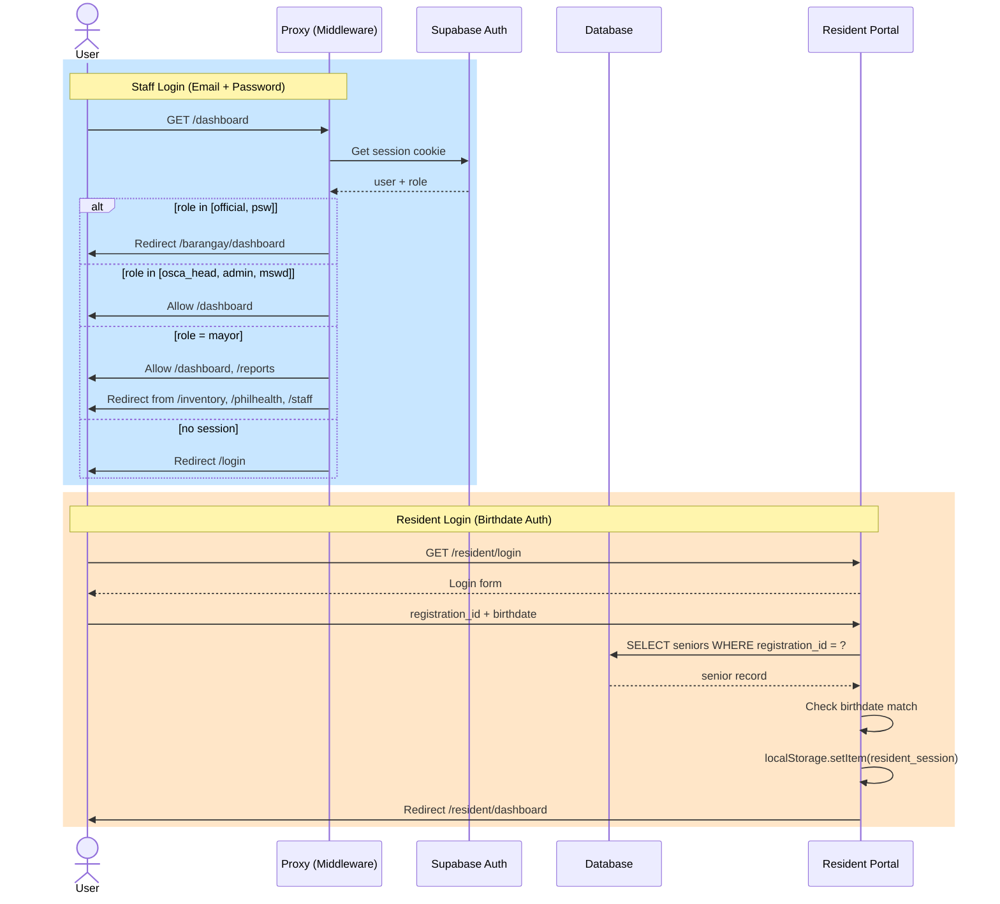

# OSCALink System Flowchart

## Role → Function → Mandate Traceability

```mermaid
flowchart TB
    subgraph "LEGAL FRAMEWORK"
        RA9994[RA 9994 - Expanded Senior Citizens Act]
        RA7160[RA 7160 - Local Government Code]
        DILG[Memorandum Circular 2005-63]
        PHIL[PhilHealth Circular 033-2017]
        ORD[Ordinance 06 s.1994 - OSCA Creation]
        PART[Partnership Phase A Agreement]
    end

    subgraph "OSCA HEAD"
        OH[OSCA Head]
        OH_F1[Manage all staff accounts]
        OH_F2[Final approval authority]
        OH_F3[PhilHealth export]
        OH_F4[Full system configuration]
        OH_F5[Quarterly report sign-off]
        OH --> OH_F1 & OH_F2 & OH_F3 & OH_F4 & OH_F5
    end

    subgraph "ADMIN (OSCA Staff)"
        AD[Admin]
        AD_F1[City-wide record management]
        AD_F2[Process assistance requests]
        AD_F3[Manage ID inventory]
        AD_F4[Manage complaints]
        AD --> AD_F1 & AD_F2 & AD_F3 & AD_F4
    end

    subgraph "MSWD OFFICER"
        MSWD[MSWD Officer]
        MSWD_F1[Verify seniors city-wide]
        MSWD_F2[Process assistance releases]
        MSWD_F3[View reports & quarterly]
        MSWD --> MSWD_F1 & MSWD_F2 & MSWD_F3
    end

    subgraph "BARANGAY OFFICIAL"
        BO[Barangay Official]
        BO_F1[Barangay-locked senior records]
        BO_F2[Pipeline: Pending → Pending OSCA]
        BO_F3[Endorse batches to city level]
        BO_F4[Register new seniors]
        BO --> BO_F1 & BO_F2 & BO_F3 & BO_F4
    end

    subgraph "PARA-SOCIAL WORKER"
        PSW[Para-Social Worker]
        PSW_F1[Barangay data gathering]
        PSW_F2[Pipeline: Pending → Pending OSCA]
        PSW_F3[View barangay directory]
        PSW --> PSW_F1 & PSW_F2 & PSW_F3
    end

    subgraph "MAYOR"
        MY[Mayor]
        MY_F1[View analytics dashboard]
        MY_F2[View reports & quarterly]
        MY_F3[Final activation approval]
        MY --> MY_F1 & MY_F2 & MY_F3
    end

    subgraph "RESIDENT (Senior)"
        RS[Resident]
        RS_F1[View own profile & OSCA ID]
        RS_F2[Track assistance requests]
        RS_F3[Schedule appointments]
        RS_F4[Register self via portal]
        RS --> RS_F1 & RS_F2 & RS_F3 & RS_F4
    end

    %% Mandate links
    RA9994 --> OH
    RA9994 --> AD
    RA9994 --> MSWD
    RA9994 --> BO
    RA9994 --> RS
    DILG --> OH
    DILG --> MSWD
    RA7160 --> BO
    RA7160 --> MY
    ORD --> OH
    PHIL --> OH
    PHIL --> AD
    PART --> PSW
```

## Authority Reference Table

| Role | Code | Functions | Legal Mandate | Source Doc |
|---|---|---|---|---|
| **OSCA Head** | `osca_head` | Manage staff, final approval, PhilHealth export, quarterly sign-off, settings | **RA 9994** (Sec 4-5: OSCA creation & functions), **Ordinance 06 s.1994** (OSCA mandate), **DILG MC 2005-63** (OSCA supervisory role) | [`docs/reference/senior-citizens.md`](reference/senior-citizens.md) (line 4-8), [`docs/reference/Memorandum Circular 2005-03.md`](reference/Memorandum%20Circular%202005-03.md) (line 1-6), [`docs/oscalink_role_map.md`](oscalink_role_map.md) (line 11-15) |
| **Admin (Staff)** | `admin` | City-wide records, ID inventory, complaints, requests | **RA 9994** — OSCA administrative support, **DILG MC 2005-63** — OSCA daily operations | [`docs/oscalink_role_map.md`](oscalink_role_map.md) (line 17-21) |
| **MSWD Officer** | `mswd_officer` | Verify seniors city-wide, process assistance, view reports | **RA 9994** (liaison function), **DILG MC 2005-63** — "MSWD serves as Liaison Officer between OSCA and DSWD" | [`docs/oscalink_role_map.md`](oscalink_role_map.md) (line 23-27), [`docs/explanation/mayor_readable.md`](explanation/mayor_readable.md) (line 82) |
| **Barangay Official** | `official` | Barangay senior records, pipeline verification, batch endorsements, registration | **RA 7160** (Local Gov Code — barangay devolution), **RA 9994** (barangay-level SC implementation), **DILG MC 2005-63** (barangay OSCA coordination) | [`docs/oscalink_role_map.md`](oscalink_role_map.md) (line 29-34), [`docs/needs improvement extention.md`](../needs%20improvement%20extention.md) (line 75) |
| **Para-Social Worker** | `para_social_worker` | Barangay data gathering, pipeline verification (read-limited) | **Partnership Phase A** — field data gathering extension; not in RA 9994 or DILG MC but supports barangay verification workflow | [`docs/parasocial_worker_implementation.md`](parasocial_worker_implementation.md), [`docs/parasocial_partnership_alignment.md`](parasocial_partnership_alignment.md), [`docs/oscalink_role_map.md`](oscalink_role_map.md) (line 36-40) |
| **Mayor** | `mayor` | Dashboard, reports, quarterly view-only; final activation approval | **RA 7160** (Sec 455 — city mayor executive powers), **RA 9994** (city-level accountability for SC programs) | [`docs/oscalink_role_map.md`](oscalink_role_map.md) (line 42-46) |
| **Resident (Senior)** | `resident` | Self-service profile, request tracking, appointments, registration | **RA 9994** (Sec 4 — rights & privileges, Sec 5 — benefits), **PhilHealth Circular 033-2017** (senior enrollment) | [`docs/reference/senior-citizens.md`](reference/senior-citizens.md) (line 28-50), [`docs/reference/PhilHealth Circular 033-2017 Mandatory.md`](reference/PhilHealth%20Circular%20033-2017%20Mandatory.md) |

## Route Access by Role

## Access Matrix

| Route | OSCA Head | Admin | MSWD | Official | PSW | Mayor | Resident |
|---|---|---|---|---|---|---|---|
| `/dashboard` | ✅ | ✅ | ✅ | 🔀 | 🔀 | ✅ | ❌ |
| `/directory` | ✅ | ✅ | ✅ | 🔀 | 🔀 | ❌ | ❌ |
| `/requests` | ✅ | ✅ | ✅ | 🔀 | 🔀 | ❌ | ❌ |
| `/complaints` | ✅ | ✅ | ✅ | 🔀 | 🔀 | ❌ | ❌ |
| `/inventory` | ✅ | ✅ | ❌ | 🔀 | 🔀 | ❌ | ❌ |
| `/philhealth` | ✅ | ✅ | ❌ | 🔀 | 🔀 | ❌ | ❌ |
| `/quarterly` | ✅ | ✅ | ✅ | 🔀 | 🔀 | ❌ | ❌ |
| `/timeline` | ✅ | ✅ | ✅ | 🔀 | 🔀 | ❌ | ❌ |
| `/endorsements` | ✅ | ✅ | ❌ | 🔀 | 🔀 | ❌ | ❌ |
| `/settings` | ✅ | ✅ | ✅ | 🔀 | 🔀 | ❌ | ❌ |
| `/staff` | ✅ | ✅ | ❌ | ❌ | ❌ | ❌ | ❌ |
| `/verifications` | ✅ | ✅ | ✅ | ❌ | ❌ | ❌ | ❌ |
| `/reports` | ✅ | ✅ | ✅ | ❌ | ❌ | ✅ | ❌ |
| `/barangay/*` | ❌ | ❌ | ❌ | ✅ | ✅ | ❌ | ❌ |
| `/resident/*` | ❌ | ❌ | ❌ | ❌ | ❌ | ❌ | ✅ |

> ✅ = Direct access &nbsp; 🔀 = Redirected to `/barangay/dashboard` &nbsp; ❌ = Blocked

## Multi-Stage Approval Pipeline

### Pipeline Stage Details

| Stage | Trigger | Role(s) | Columns Written | Ref |
|---|---|---|---|---|
| Pending | Registration | — | `status = 'Pending'` | [`docs/explanation/statuses.md`](explanation/statuses.md) (line 7-10) |
| Pending Barangay | Barangay verification | Official, PSW | `status = 'Pending Barangay'`, `verified_by`, `verified_at` | [`docs/explanation/statuses.md`](explanation/statuses.md) (line 12-16) |
| Pending OSCA | City-level escalation | Official, PSW | `status = 'Pending OSCA'` | [`docs/explanation/statuses.md`](explanation/statuses.md) (line 17-21) |
| Pending Mayor | OSCA approval | OSCA Head, Admin | `status = 'Pending Mayor'`, `osca_approved=true`, `osca_approved_by`, `osca_approved_at` | [`docs/reference/database-schema.md`](reference/database-schema.md) (line 58-63), [`docs/explanation/statuses.md`](explanation/statuses.md) (line 22-26) |
| Active | Mayor activation | Mayor | `status = 'Active'`, `mayor_approved=true`, `mayor_approved_by`, `mayor_approved_at` | [`docs/explanation/statuses.md`](explanation/statuses.md) (line 27-31) |

## Data Isolation Model

## Permission Matrix by Role

| Permission | OSCA Head | Admin | MSWD | Official | PSW | Mayor | Resident |
|---|---|---|---|---|---|---|---|
| `canManageAllSectors` | ✅ | ✅ | ✅ | ❌ | ❌ | ❌ | ❌ |
| `canManageUsers` | ✅ | ✅ | ❌ | ❌ | ❌ | ❌ | ❌ |
| `canExportPhilHealth` | ✅ | ✅ | ❌ | ❌ | ❌ | ❌ | ❌ |
| `canApproveFinal` | ✅ | ❌ | ❌ | ❌ | ❌ | ❌ | ❌ |
| `canVerifySeniors` | ✅ | ✅ | ✅ | ✅ | ✅ | ✅ | ❌ |
| `canProcessAssistance` | ❌ | ❌ | ✅ | ✅ | ❌ | ❌ | ❌ |
| `canManageComplaints` | ✅ | ✅ | ✅ | ❌ | ❌ | ❌ | ❌ |
| `canViewAllRequests` | ✅ | ✅ | ✅ | ❌ | ❌ | ❌ | ❌ |
| `canManageInventory` | ✅ | ✅ | ❌ | ❌ | ❌ | ❌ | ❌ |
| `canAccessSettings` | ✅ | ✅ | ✅ | ❌ | ❌ | ❌ | ❌ |
| `canViewReports` | ✅ | ✅ | ✅ | ❌ | ❌ | ✅ | ❌ |
| `sectorLocked` | ❌ | ❌ | ❌ | ✅ | ✅ | ❌ | ❌ |
| `canViewOwnData` | ❌ | ❌ | ❌ | ❌ | ❌ | ❌ | ✅ |

## System Entity Relationships

## Auth Flow

---

### Code References

All claims in this flowchart are enforced at these source files:

| Component | File | Lines |
|---|---|---|
| Permission matrix | `web/src/lib/rbac.ts` | 52-165 |
| Route auth (proxy middleware) | `web/src/proxy.ts` | 39-119 |
| Pipeline status constraint | `web/supabase/migrations/20260524000001_consolidated_phase_a.sql` | 23-25 |
| RLS policies (barangay isolation) | `web/supabase/migrations/20260524000001_consolidated_phase_a.sql` | 83-120 |
| Pipeline verify logic | `web/src/app/actions/seniors.ts` | — |
| Resident auth | `web/src/app/resident/login/page.tsx` | 32-83 |
